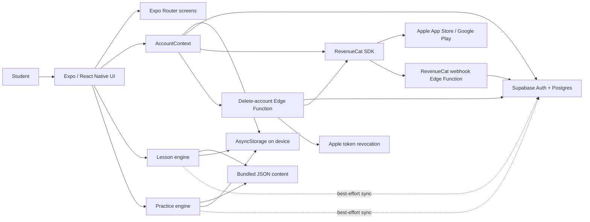
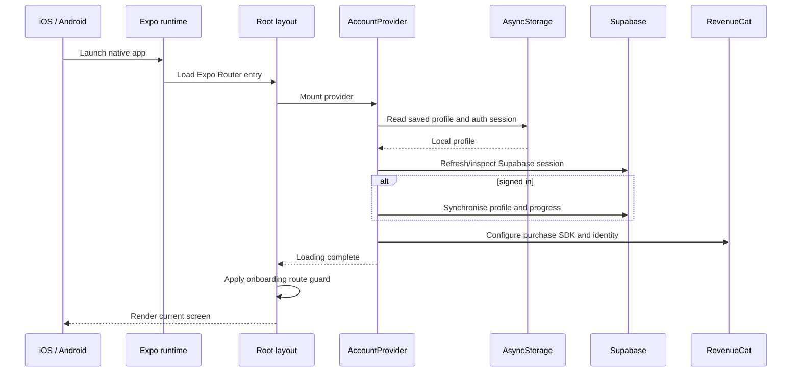

# 1. System overview

## What kind of application is this?

ACE TMUA is a mobile client with a small backend. Most of the learning
experience runs directly on the phone:

- lesson and question content is bundled in JSON files;
- React Native renders the interface;
- lesson and practice state is saved on the device;
- the app can therefore remain useful when the network is slow or unavailable.

Online services add capabilities that a single phone cannot provide:

- **Supabase** creates accounts and backs data up across devices;
- **RevenueCat** connects Apple/Google purchases to Premium access;
- **Supabase Edge Functions** safely use private credentials for webhooks and
  account deletion.

This is described as a **local-first** architecture. The phone is the immediate
source of the user experience, while the cloud supplies identity, recovery, and
synchronisation.

## The architecture at a glance

Solid arrows are part of normal interaction. Dotted sync arrows are allowed to
fail temporarily because the local copy has already been saved.

## The five main layers

### 1. Routes and screens

Files inside [`src/app`](../src/app) are routes. For example:

| File | Route | Purpose |
| --- | --- | --- |
| `src/app/(tabs)/index.tsx` | `/` | Home dashboard |
| `src/app/(tabs)/learn.tsx` | `/learn` | Topic and lesson roadmap |
| `src/app/lesson/[lessonId].tsx` | `/lesson/:lessonId` | A dynamic lesson |
| `src/app/(tabs)/questions.tsx` | `/questions` | Practice catalogue |
| `src/app/practice/[testId]/test.tsx` | `/practice/:testId/test` | Practice runner |
| `src/app/(tabs)/profile.tsx` | `/profile` | Account, progress, and deletion |

[`src/app/_layout.tsx`](../src/app/_layout.tsx) is the root shell. It installs
the account provider, protects onboarding, declares the root stack, and handles
taps on notifications. [`src/app/(tabs)/_layout.tsx`](../src/app/(tabs)/_layout.tsx)
declares the five native system tabs.

### 2. Reusable components

Screens are assembled from components. Components receive **props** (inputs)
and often hold **state** (values that change while the user interacts).

The most important component areas are:

- [`src/components/lesson`](../src/components/lesson) for lesson screen types,
  mathematical rendering, diagrams, and the lesson player;
- [`src/components/practice`](../src/components/practice) for question display,
  navigation, timers, selection, persistence, and results;
- [`src/components/home`](../src/components/home) for calculated dashboard data.

### 3. Content and configuration

Content is separated from rendering:

- [`src/data/lessons.json`](../src/data/lessons.json) contains 32 lessons and
  their screen sequences;
- [`src/data/practice-tests.json`](../src/data/practice-tests.json) defines one
  starter diagnostic and two Premium mock formats;
- [`src/data/practice-question-bank.json`](../src/data/practice-question-bank.json)
  currently contains 63 mock-paper questions;
- [`app.json`](../app.json) configures the app name, scheme, platform IDs,
  icons, splash screen, and native plugins.

Separating content from code means a new lesson normally does not require a
new React component. It only needs valid data matching the existing types.

### 4. Client-side services

Files in [`src/services`](../src/services) handle operations that are shared by
several screens:

- local account storage;
- authentication redirects;
- local/cloud synchronisation;
- Supabase database reads and writes;
- notification scheduling;
- RevenueCat configuration;
- server-side deletion requests.

This prevents every screen from implementing its own slightly different
version of the same logic.

### 5. Backend and external services

[`supabase/schema.sql`](../supabase/schema.sql) describes the cloud database.
[`supabase/functions`](../supabase/functions) contains code that runs on
Supabase servers, not on the student's phone.

That distinction is important:

- the mobile app contains only public client keys and acts as the signed-in
  user;
- Edge Functions may contain private server credentials and perform privileged
  actions after verifying the caller.

## What happens when the app starts?

The loading state matters. Without it, the router could briefly show Home,
then discover that onboarding was incomplete and jump away. The provider first
reconstructs the account state, then the route guard makes its decision.

## The main user journeys

The repository becomes easier to understand if you follow behaviours rather
than individual files.

### Complete a lesson

1. Learn opens `/lesson/[lessonId]` with an ID.
2. The route finds the lesson in `lessons.json`.
3. `LessonPlayer` walks through its array of typed screens.
4. Question screens report whether an answer was correct.
5. Completion is written to AsyncStorage immediately.
6. A detailed activity event is saved locally and sent to Supabase if signed
   in and online.
7. Home recalculates progress, streak, and recommendations from the saved data.

### Take a mock paper

1. Questions opens a test definition.
2. The instruction screen chooses timed or untimed mode.
3. A blueprint-based mock selects a balanced random set from the bank.
4. Every answer, flag, and current position is saved in a practice session.
5. The timer is derived from the original start time, so leaving the screen
   does not pause a timed attempt.
6. Submission produces a result with total and topic scores.
7. The result is saved locally, backed up to Supabase, and displayed with full
   explanations.

### Sign in and synchronise

1. Supabase establishes a session.
2. `AccountContext` gives RevenueCat the same Supabase user ID.
3. Existing local data is uploaded unless the device has switched to a
   different account.
4. Remote profile/progress is downloaded and merged.
5. Screens receive the new state through `useAccount()`.

### Buy Premium

1. The app asks RevenueCat to show the current paywall.
2. RevenueCat performs the store purchase and returns updated customer info.
3. The app checks for the configured entitlement, `AceTMUA Pro` by default.
4. Premium screens unlock based on that entitlement.
5. Separately, a RevenueCat webhook updates the Supabase `entitlements` table
   so the server also has a current record.

## Source of truth: it depends on the question

There is deliberately not one source of truth for everything:

| Question | Immediate source of truth |
| --- | --- |
| Which page is visible? | Expo Router navigation state |
| Which lesson screen is visible? | `LessonPlayer` React state |
| What has this device saved? | AsyncStorage |
| Who is signed in? | Supabase Auth session |
| What profile should sync across devices? | Supabase plus merge rules |
| Is Premium active right now? | RevenueCat customer entitlement |
| What content exists? | Bundled JSON files |

An interview-quality explanation recognises these separate responsibilities
instead of saying vaguely that “the database stores everything.”

## Current implementation boundaries

The codebase is substantial, but it is still an MVP:

- the leaderboard is static demonstration data, not a live competitive system;
- there is no automated unit or end-to-end test suite yet;
- local writes that fail to sync are retried during later account sync, but
  there is no dedicated persistent retry queue;
- Apple authentication and production purchases require correct paid developer
  accounts and external dashboard configuration;
- terms, privacy, support, and store release details still need completing;
- `AccountContext` coordinates many concerns and may eventually benefit from
  being split into account, sync, and purchase providers.

Knowing the boundaries is part of understanding the system. It also gives a
credible answer when an interviewer asks what you would improve next.
