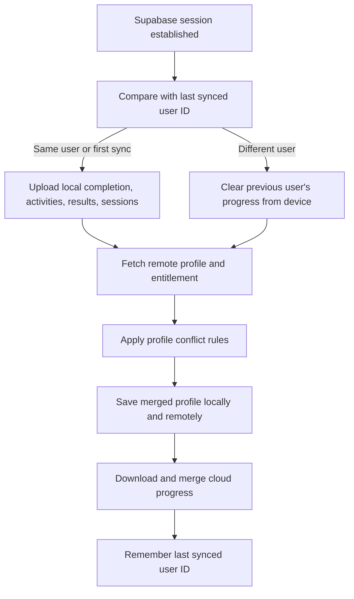

# 3. State, storage, and synchronisation

## The central question: where does a value live?

Many bugs come from not knowing which copy of a value is authoritative. ACE
TMUA uses several kinds of state because each has a different lifetime.

| State type | Lifetime | Example |
| --- | --- | --- |
| Component state | Until the screen/component unmounts | Current lesson screen |
| Context state | While the app process is running | Current account profile |
| AsyncStorage | Across app restarts on one device | Lesson completion |
| Supabase Auth | Across devices through a session/account | Signed-in identity |
| Supabase Postgres | Persistent cloud backup | Profile and practice results |
| RevenueCat | Store-backed subscription lifetime | Premium entitlement |
| Bundled JSON | Fixed until an app/content update | Lessons and questions |

React state does not persist itself. A state setter changes the rendered UI,
but a corresponding storage operation is needed if the value must survive a
restart.

## `AccountContext` is the app-wide coordinator

[`src/contexts/AccountContext.tsx`](../src/contexts/AccountContext.tsx) exposes a
single `useAccount()` interface. Screens do not directly initialise Supabase or
RevenueCat. They ask the context to do it.

Its public value includes:

- `profile` and `session`;
- loading and syncing status;
- `isSignedIn` and `isPremium`;
- update, onboarding, sign-in, sign-out, and password actions;
- Premium paywall, restore, and subscription-management actions;
- account deletion.

This gives consistent behaviour across Onboarding, Profile, Premium, and the
practice gate. The trade-off is that the file has become large and coordinates
several domains.

## Local profile storage

[`src/services/account-storage.ts`](../src/services/account-storage.ts) defines
the shape of an `AccountProfile` and saves it under:

```text
@ace-tmua/account/profile/v1
```

The `/v1` suffix versions the stored format. A future incompatible format could
use `/v2` and migrate old data rather than guessing its shape.

`createEmptyProfile()` creates a guest identity with sensible defaults. Reading
a profile passes through normalisation, which:

- fills missing fields;
- constrains target score to 1.0–9.0;
- migrates old percentage-like scores by dividing values above 9 by 10;
- validates study days and time;
- treats malformed JSON as no saved profile instead of crashing.

## Why `AccountContext` keeps refs as well as state

The provider stores both `profile` and `profileRef.current`. They represent the
same logical value, but serve different purposes:

- state causes React to render the new profile;
- a ref lets asynchronous callbacks read the latest profile immediately,
  without depending on the render during which a closure was created.

For example, `commitProfile` first persists, then updates both:

```tsx
const commitProfile = useCallback(async (nextProfile: AccountProfile) => {
  const savedProfile = await saveLocalAccountProfile(nextProfile);
  profileRef.current = savedProfile;
  setProfile(savedProfile);
  return savedProfile;
}, []);
```

The same pattern is used for the current Supabase session, RevenueCat user ID,
the live practice session, and the “already submitting” flag. Refs prevent
double submission and stale asynchronous decisions without causing renders.

## Local-first writes

A profile edit calls `updateProfile`:

1. merge the patch into the current local profile;
2. update `updatedAt`;
3. save to AsyncStorage;
4. update React state so the UI changes;
5. if signed in, attempt a Supabase upsert;
6. expose a sync error if the cloud operation fails.

The local save happens first. A poor connection should not make a name or study
target appear to reset.

Lessons and practice use the same principle:

- save the activity/session/result locally with `await`;
- start the cloud write without blocking the user journey;
- log a warning if that write fails;
- upload local records again when an account later synchronises.

This is why you will see code such as:

```ts
void pushPracticeResult(result).catch((error) => {
  console.warn("Practice result will sync later:", error);
});
```

`void` explicitly says the promise is intentionally not awaited at this point.

## Important AsyncStorage records

| Key/prefix | Content |
| --- | --- |
| `completedLessonIds` | Array of completed lesson IDs |
| `@ace-tmua/lesson-activity/v1` | Detailed lesson activity events |
| `@ace-tmua/practice/session/v1/<testId>` | Active attempt for a test |
| `@ace-tmua/practice/results/v1` | Up to 100 recent results |
| `@ace-tmua/account/profile/v1` | Local account profile |
| `@ace-tmua/account/last-synced-user/v1` | User ID used to detect account changes |
| `@ace-tmua/notifications/...` | IDs of scheduled notifications |

AsyncStorage is a key-value store. Objects and arrays are converted to JSON
strings before saving and parsed after reading.

## What happens when a user signs in?

[`src/services/account-sync.ts`](../src/services/account-sync.ts) implements the
merge.



Clearing progress when a different account signs in prevents one student's
answers from being silently attached to another student's account.

## Profile conflict rules

The sync code prefers the remote profile when:

- the device changed to a different authenticated user;
- the cloud says onboarding is complete but the local profile does not;
- both copies completed onboarding and the remote `updated_at` is newer.

Otherwise it favours useful local values and fills gaps from Supabase. It then
writes the merged profile to both sides so they converge.

This is a deliberately simple **last-updated plus special cases** policy. It is
not a field-by-field collaborative merge. Two devices editing different fields
at the same time could still overwrite one another.

## How progress is merged

Different record types use suitable identities:

- completed lesson IDs are combined as a set;
- lesson activity uses `client_event_id`, so the same event can be safely
  upserted without duplication;
- practice results merge by result ID, newest first, with a 100-result limit;
- practice sessions have one row per user/test, and the copy with the newer
  `updatedAt` wins.

The generated client IDs make writes **idempotent**: retrying an upsert for the
same result or activity updates/keeps one record instead of creating duplicates.

## The cloud API boundary

[`src/services/cloud-api.ts`](../src/services/cloud-api.ts) is a thin data-access
layer. It knows Supabase table and column names. UI components do not.

For example, a local camelCase profile is translated into database snake_case:

```ts
await supabase.from("profiles").upsert({
  id: userId,
  display_name: profile.name,
  target_university: profile.targetUniversity,
  target_score: profile.targetScore,
});
```

Keeping this translation in one area makes schema changes easier to locate.

## Premium has a separate immediate source of truth

The provider calculates:

```ts
isPremium: revenueCatPremium ?? profile.premiumStatus === "premium"
```

Once RevenueCat has loaded, its active entitlement wins. The saved profile
value is only a startup/failure fallback. This avoids treating a mutable client
database flag as proof of an active store subscription.

The Supabase `entitlements` row still matters for server-side awareness and
cross-device hydration, but store access should follow RevenueCat customer
information.

## What works offline?

Once the app and content are installed, a user can generally:

- browse bundled lessons;
- complete lessons;
- start, save, resume, and submit practice;
- view locally saved results;
- see locally derived Home statistics.

Operations that need a network include:

- creating/signing into an account;
- cross-device sync;
- password reset email;
- loading and completing a real store purchase;
- server-side account deletion.

## Current sync limitations

An interview answer should include the trade-offs:

- there is no network-state-aware persistent job queue;
- a best-effort write can remain local until a later sign-in/refresh sync;
- there is no tombstone mechanism for every deletion, so deletion conflicts
  need more design if arbitrary records become editable;
- profile conflict resolution is whole-profile, not field-level;
- AsyncStorage is convenient but not encrypted storage for secrets (Supabase's
  mobile session persistence is normal here, but highly sensitive custom data
  should use secure storage).

For the MVP's append-heavy progress data, stable IDs and upserts give a useful
balance of simplicity and resilience.
