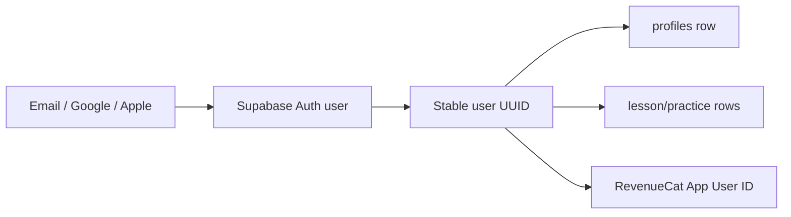
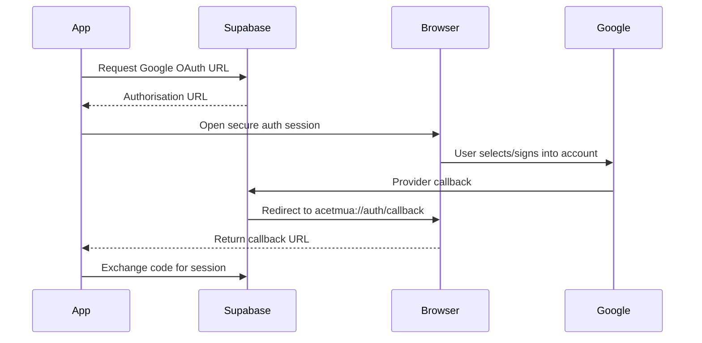
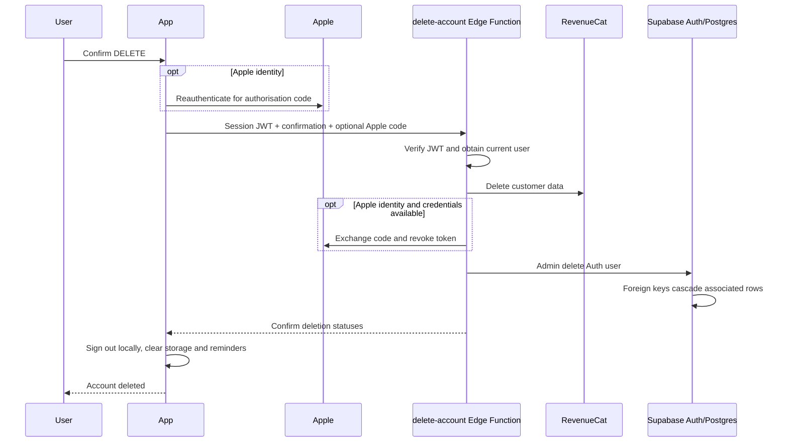

# 4. Onboarding, authentication, and accounts

## Onboarding is a product flow and a data-collection flow

[`src/app/onboarding.tsx`](../src/app/onboarding.tsx) uses one route with a
`step` state variable rather than six separate routes. That keeps Back/Continue
behaviour and the partially entered form in one component.

The sequence is:

| Step | Purpose | Saved values/action |
| --- | --- | --- |
| 0 | Explain the product | None |
| 1 | Personalise the experience | Name |
| 2 | Make a concrete goal | University, TMUA target, sitting |
| 3 | Establish a routine | Days, time, study/trial reminder choices |
| 4 | Protect progress | Email, Google, Apple, or guest |
| 5 | Choose a plan | Free or RevenueCat Premium paywall |

Important UX choices also have technical consequences:

- the TMUA score is constrained to 1.0–9.0;
- “Other” supports universities not in the bundled list;
- notification permission is requested only after the user has chosen a
  schedule and understands why;
- trial copy promises a reminder only if the real RevenueCat entitlement is a
  trial with a known expiry time;
- a user can continue as a guest because local-first storage does not require
  an account.

When the final step calls `finishOnboarding`, the context persists
`onboardingCompleted: true`. The root route guard then permits the main app.

## Authentication is identity, not profile storage

Supabase Auth answers “who is this user?” It returns a **session** containing
tokens and a user with a UUID. The app's `profiles` table stores study-specific
information for that UUID.

This separation lets one account use different login providers while keeping
one application profile.



## Email account creation

`AuthPanel` calls `signUpWithEmail` in
[`AccountContext.tsx`](../src/contexts/AccountContext.tsx). The provider includes
the current onboarding values as user metadata:

```ts
client.auth.signUp({
  email,
  password,
  options: {
    emailRedirectTo: authRedirectUri,
    data: {
      full_name: profileRef.current.name,
      target_score: profileRef.current.targetScore,
      // other onboarding fields
    },
  },
});
```

The database's `handle_new_user` trigger reads this metadata and creates the
initial `profiles` and `entitlements` rows.

Supabase can be configured in two ways:

- **email confirmation disabled:** sign-up immediately returns a session and
  the app signs the new user in;
- **email confirmation enabled:** sign-up returns a user but no session. The
  app explains that the user must open the email link. Until then, the local
  onboarding flow can continue but `isSignedIn` remains false.

That distinction explains why “account created” is not always the same as
“currently authenticated.” It is intentional Supabase behaviour, not merely a
React state issue.

## Email confirmation and deep links

The custom URL scheme in [`app.json`](../app.json) is `acetmua`. The auth
service creates a callback like:

```text
acetmua://auth/callback
```

When the user opens the confirmation link, Supabase redirects into the app.
[`src/app/auth/callback.tsx`](../src/app/auth/callback.tsx) receives either:

- a short-lived authorization code and exchanges it for a session; or
- access and refresh tokens from an older implicit-style response.

After the session is established, Supabase's auth subscription notifies
`AccountContext`, which hydrates and synchronises the account.

## Email sign-in and password reset

Email sign-in calls `signInWithPassword`. A successful result contains a
session, which is stored by the Supabase client and passed to the sync flow.

Password reset has two stages:

1. `resetPasswordForEmail` sends an email with a redirect to
   `acetmua://reset-password`;
2. [`src/app/reset-password.tsx`](../src/app/reset-password.tsx) establishes the
   recovery session, validates two matching passwords, and calls
   `supabase.auth.updateUser`.

The redirect must be allowed in the Supabase dashboard as well as handled by
the app.

## Google OAuth

Google sign-in uses a system authentication browser, not an embedded password
form:



[`src/services/auth-service.ts`](../src/services/auth-service.ts) uses
`WebBrowser.openAuthSessionAsync` and `makeRedirectUri`. Supabase must have its
Google provider enabled with the client ID and secret created in Google Cloud.
Google's authorised redirect URI points to Supabase's callback; Supabase then
returns to the app's custom scheme.

The mobile app must never contain the Google client secret.

## Sign in with Apple

Apple authentication is native on supported Apple devices:

1. create a random **nonce**;
2. hash it and give the hash to Apple's sign-in request;
3. receive an Apple identity token;
4. give Supabase the identity token and the original nonce;
5. Supabase verifies the token and nonce before establishing a session.

A nonce makes a captured token unsuitable for replay in a different request.

Apple may provide the user's full name only on the first authorisation. The app
saves it to Supabase user metadata when available.

This flow needs:

- the `expo-apple-authentication` plugin;
- the iOS Sign in with Apple capability;
- a paid Apple Developer team and correct App ID/service configuration for
  real-device/release use;
- the Apple provider and credentials configured in Supabase.

The button appearing in a simulator does not prove the provider is correctly
configured end to end.

## Session persistence and refresh

[`src/lib/supabase.ts`](../src/lib/supabase.ts) creates the Supabase client with:

- AsyncStorage on native platforms;
- persistent sessions;
- automatic refresh tokens;
- URL detection disabled because mobile callback handling is explicit;
- `processLock` to prevent concurrent auth operations interfering.

When the app moves to the foreground it starts auto-refresh; in the background
it stops. On startup, `getSession()` reconstructs the saved sign-in.

## Guest mode

A guest has a generated local ID and `accountType: "guest"`. Lessons, practice,
Home, targets, and reminders can still work from AsyncStorage.

Guest mode is not an anonymous Supabase account. No server user exists. This
keeps onboarding friction low but means deletion/account recovery do not apply
until the user creates an account.

When that user later signs in for the first time, local progress is uploaded to
the authenticated UUID and then merged with any remote data.

## Sign-out behaviour

Signing out:

- asks Supabase to end the session;
- changes the local profile to guest mode;
- removes the email and local Premium fallback;
- causes RevenueCat to log out the identified user and create/use an anonymous
  RevenueCat identity.

The current code intentionally leaves study progress on the device, as the UI
message says. A different Supabase user signing in later triggers the
“different user” protection and clears the previous user's progress before
downloading the new user's data.

## Account deletion

Deletion is more sensitive than sign-out. It requires a server operation
because a normal mobile client is not allowed to delete arbitrary Auth users.

The Profile flow requires the user to type `DELETE`, warns that App Store/Play
Store subscriptions are separate, and offers subscription management.



The Edge Function refuses to continue if RevenueCat customer deletion fails,
avoiding a misleading partial success. Apple revocation can return
`manual-required`; in that case the app tells the user how to stop using Apple
ID manually.

Deleting the ACE TMUA account does **not** cancel an App Store or Google Play
subscription. Store billing belongs to the store account. That is why Profile
links to subscription management before deletion.

## Authentication security boundaries

- The `EXPO_PUBLIC_SUPABASE_PUBLISHABLE_KEY` is designed to be included in the
  client. RLS limits what it can do.
- The Supabase service-role key must exist only in server secrets.
- Google/Apple client secrets and Apple private keys must never be in the app.
- A route guard is not data security; RLS is.
- A client claim like `premiumStatus: "premium"` is not sufficient proof of a
  subscription; RevenueCat's signed store state is checked.
- Account deletion verifies the caller's bearer token server-side before using
  admin privileges.

## Useful interview explanation

“Supabase Auth establishes a stable user UUID from email, Google, or Apple. The
app persists the mobile session and uses that UUID for profile/progress rows
and as the RevenueCat App User ID. On sign-in it merges local-first data with
the cloud. Sensitive operations such as deleting the Auth user run in an Edge
Function after verifying the user's JWT; private keys never ship in the app.”
