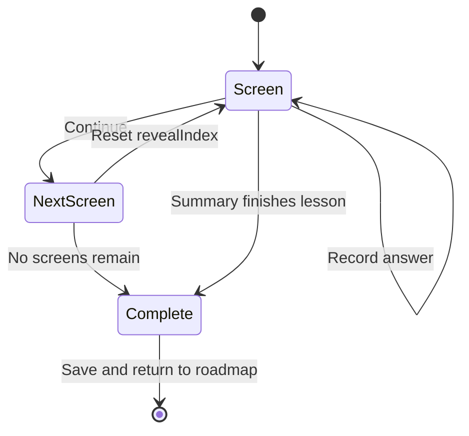
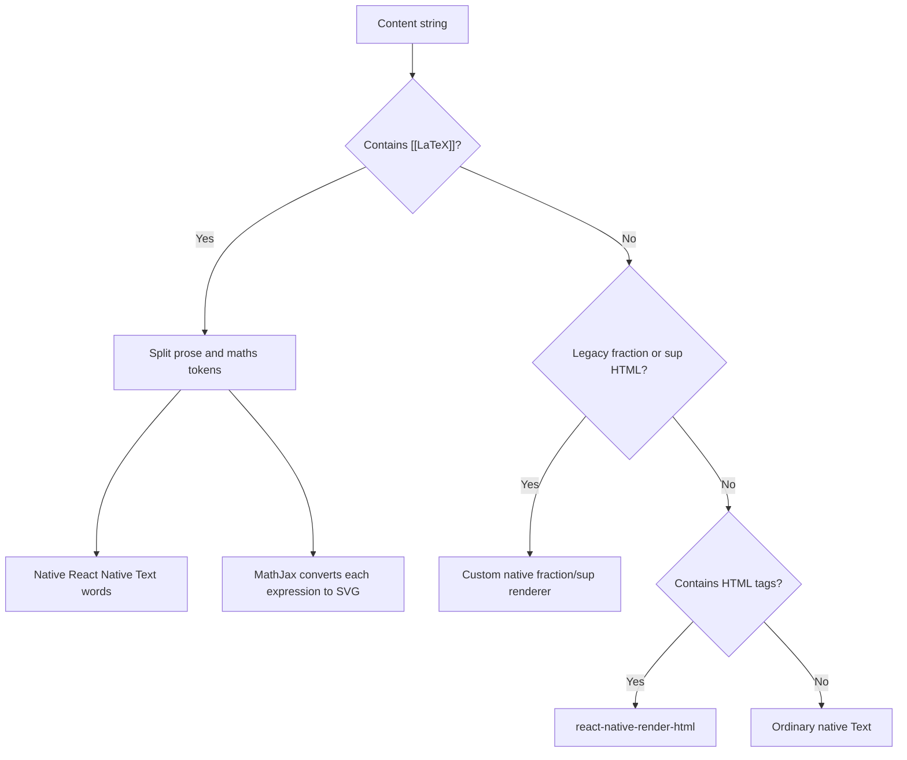

# 5. Lessons and mathematical rendering

## Lessons are data-driven

All lesson content lives in
[`src/data/lessons.json`](../src/data/lessons.json). React components define how
screen types look, but the JSON defines which screens appear and what they say.

The TypeScript contract is in
[`src/components/lesson/types.ts`](../src/components/lesson/types.ts):

```ts
interface Lesson {
  id: string;
  topicId: string;
  title: string;
  screens: LessonScreen[];
}

type LessonScreen =
  | ConceptScreen
  | RevealScreen
  | TrueFalseScreen
  | MultipleChoiceScreen
  | WorkedExampleScreen
  | MilestoneScreen
  | LessonSummaryScreen;
```

The `type` field is a **discriminant**. When `screen.type` is
`"multipleChoice"`, TypeScript knows that `options`, `answerIndex`, and feedback
fields exist.

## What each screen type does

| Type | Role | Interaction |
| --- | --- | --- |
| `concept` | Explain one idea | Continue |
| `reveal` | Break reasoning into stages | Reveal one step at a time |
| `trueFalse` | Quick conceptual check | Choose true/false, see feedback |
| `multipleChoice` | TMUA-style check | Choose option, see feedback |
| `workedExample` | Model a complete solution | Reveal reasoning and final answer |
| `milestone` | Motivation/transition | Continue |
| `lessonSummary` | Review and score | Finish lesson |

This vocabulary lets content authors design a varied lesson without writing
new UI code for every page.

## From roadmap to lesson player

1. Learn filters lessons by `topicId` and displays them in JSON order.
2. Tapping an unlocked lesson navigates with its `lessonId`.
3. [`src/app/lesson/[lessonId].tsx`](../src/app/lesson/[lessonId].tsx) finds the
   object and passes it to `LessonPlayer`.
4. [`LessonPlayer.tsx`](../src/components/lesson/LessonPlayer.tsx) manages the
   session and routes each screen object to the correct view component.

The outer player uses the lesson ID as a React `key`:

```tsx
export default function LessonPlayer(props: Props) {
  return <LessonPlayerSession key={props.lesson.id} {...props} />;
}
```

If the route changes directly from one lesson to another, the key changes.
React unmounts the old session and mounts a fresh one, resetting its state
without a synchronous reset effect.

## `LessonPlayer` is a small state machine

It tracks:

- `screenIndex`: current position in the lesson;
- `revealIndex`: number of reasoning steps visible on this screen;
- `correctAnswers`: correct scored interactions so far;
- `totalAnswers`: all scored interactions so far;
- `isComplete`: whether to show the final completion page.



Progress is the current one-based position divided by total screens, or 100%
after completion:

```ts
return ((screenIndex + 1) / lesson.screens.length) * 100;
```

Reveal state resets whenever the player moves to a new screen. Answer state
does not, because the summary needs a lesson-wide score.

## Why completion uses refs

`finish()` might be reached more than once through rapid presses or different
paths. `completionRecorded.current` prevents duplicate activity records and
`completionPromise.current` lets Exit wait for the in-progress save.

On completion the player:

1. adds the lesson ID to `completedLessonIds` if absent;
2. records a lesson activity with duration and answer counts;
3. starts a best-effort Supabase upsert;
4. calls an optional completion callback;
5. shows the complete screen.

The activity has its own generated ID, so retrying cloud sync remains
idempotent.

## Mathematical authoring format

The preferred content marker is double square brackets containing LaTeX:

```json
{
  "body": "Using [[a^m a^n = a^{m+n}]], combine the indices."
}
```

This is not standard Markdown. It is an ACE TMUA authoring convention. The
renderer extracts `[[...]]` and sends only those expressions to MathJax.

Examples:

| Desired maths | Content marker |
| --- | --- |
| \(x^2\) | `[[x^2]]` |
| \(x^{3/2}\) | `[[x^{3/2}]]` |
| \(\frac{x^2-4}{x\sqrt{x}}\) | `[[\frac{x^2-4}{x\sqrt{x}}]]` |
| \(\int_0^1 x^2\,dx\) | `[[\int_0^1 x^2\,dx]]` |
| \(\forall x\in\mathbb R\) | `[[\forall x\in\mathbb{R}]]` |

In JSON, every backslash must be escaped. The JSON text therefore contains
`"[[\\frac{1}{2}]]"` even though the resulting JavaScript string contains
`[[\frac{1}{2}]]`.

Use normal text for plain numbers embedded in prose. Rendering the number 4 as
an SVG splits a sentence into extra layout elements and makes wrapping worse.

## What `MathText` actually uses

[`src/components/lesson/MathText.tsx`](../src/components/lesson/MathText.tsx)
exports `PlainOrHtml`. Despite the friendly component name, it contains a
multi-path renderer:



So the current answer is:

- mathematical expressions are authored as LaTeX;
- `react-native-mathjax-html-to-svg` asks MathJax to turn them into SVG;
- prose remains native text so it can wrap;
- legacy `<sup>` and fraction markup is still supported for backwards
  compatibility;
- `react-native-render-html` handles other genuine HTML.

It is not KaTeX and it is not one full WebView containing the entire paragraph.

## Why expressions and prose are separated

Rendering a whole sentence as one SVG would produce reliable mathematics but
poor paragraph wrapping and accessibility. Rendering every character as native
text would make fractions, roots, matrices, and integrals unreliable.

The hybrid approach keeps prose flexible and gives complex expressions to a
mathematics engine. Its main layout challenge is that React Native sees an
inline SVG as a separate flex item, so it can wrap between prose and maths.

`MathText` reduces awkward breaks by:

- grouping nearby brackets, quotes, and punctuation with an expression;
- using word-joiner characters around prose delimiters;
- leaving plain numbers as text;
- keeping a base next to legacy `<sup>` markup;
- rendering prose as individual word text nodes inside a wrapping row;
- increasing MathJax's optical size, especially for stacked expressions.

## Bold text and bold maths

The renderer inspects the supplied React Native font weight. If surrounding
text is bold, it wraps LaTeX in `\boldsymbol{...}`. This helps visual
consistency, but authors should avoid using bold style as a substitute for
mathematical grouping. Braces in LaTeX control grouping; UI font weight controls
emphasis.

## Escaping `<` and `>`

MathJax processes an HTML document before parsing TeX. A raw `<` can be
mistaken for the start of an HTML tag. `toMathJaxMarkup` converts raw relation
characters to `\lt` and `\gt` before rendering.

## Lesson diagrams

Some screen types have an optional `diagram` with a known `kind`. The union of
allowed kinds is in `types.ts`; implementations are in
[`LessonDiagram.tsx`](../src/components/lesson/LessonDiagram.tsx).

The diagrams use `react-native-svg` primitives such as `Path`, `Line`,
`Polygon`, `Circle`, and SVG text. They are vector graphics, so curves and lines
remain sharp at different screen densities.

A finite `kind` union provides two benefits:

- JSON cannot silently request an arbitrary, nonexistent component once it is
  type checked;
- one visual can be reused in concept, question, and worked-example screens.

For diagrams with semantic mathematical labels, the current SVG text is
manually positioned rather than using the general MathJax component.

## Adding a lesson safely

1. Choose one of the eight existing `topicId` values.
2. Add a unique lesson ID and title to `lessons.json`.
3. Build an ordered `screens` array using the existing discriminated types.
4. Use `[[LaTeX]]` for actual expressions and plain text for ordinary numbers.
5. Include a `lessonSummary` as the final teaching screen.
6. Add a subtitle for the lesson ID in `LESSON_SUBTITLES` in `learn.tsx`.
7. Check that the preceding lesson unlock rule matches the intended order.
8. Run the maths migration/check script only on a branch and review its diff.
9. Run TypeScript and lint, then visually complete the lesson on a narrow and a
   large phone.

## Common content mistakes

- forgetting to double escape LaTeX backslashes in JSON;
- unmatched `[[` and `]]` markers;
- putting several sentences into one maths marker;
- using `[[4]]` in ordinary prose;
- an `answerIndex` that is zero-based in code but written as though it were
  one-based;
- a missing summary screen;
- a false explanation even though the renderer is correct;
- very long unbreakable formulae that need a dedicated line or smaller style;
- a diagram kind added to the type but not implemented in the switch, or vice
  versa.

## Useful interview explanation

“Lessons are JSON-driven and validated conceptually by a discriminated TypeScript
union. `LessonPlayer` is a small state machine that routes each content screen
to a reusable view, tracks reveals and scored answers, and persists an
idempotent completion event. Maths uses a hybrid renderer: normal prose remains
native text for wrapping, while `[[LaTeX]]` tokens are converted by MathJax to
SVG. SVG lesson diagrams cover the fixed graph and geometry visuals.”
