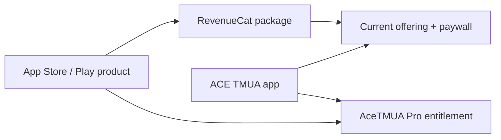

# 8. Premium, RevenueCat, and notifications

## Why RevenueCat exists

Apple and Google own the billing transaction. The app should not collect card
details or invent its own receipt validation. RevenueCat sits between the app
and the stores and provides one cross-platform concept: an **entitlement**.

ACE TMUA checks an entitlement named `AceTMUA Pro` by default. Products and
packages can change (monthly, season, yearly) while the app continues to ask the
simpler question: “is this entitlement active?”



The product must be connected to the entitlement **and** placed in a package in
the current offering. A visually published paywall alone is not enough.

## Environment configuration

[`src/services/revenuecat.ts`](../src/services/revenuecat.ts) selects a key:

1. in a development build, use `EXPO_PUBLIC_REVENUECAT_TEST_API_KEY` if present;
2. otherwise use the public iOS, Android, or web platform SDK key;
3. reject a `test_` key in a non-development build.

Typical variables are:

```text
EXPO_PUBLIC_REVENUECAT_TEST_API_KEY=...
EXPO_PUBLIC_REVENUECAT_IOS_API_KEY=...
EXPO_PUBLIC_REVENUECAT_ANDROID_API_KEY=...
EXPO_PUBLIC_REVENUECAT_ENTITLEMENT_ID=AceTMUA Pro
```

These are public SDK keys, not RevenueCat secret REST API keys.

The Test Store makes development possible without production App Store
products. Real iOS purchases need App Store Connect products, agreements,
sandbox/store accounts, correct bundle IDs, and a signed native build.

## SDK initialisation

RevenueCat is initialised in `AccountContext` after the local account has loaded.

The provider:

- selects the key for the platform/build;
- enables debug logs during development;
- configures the native SDK once;
- uses the Supabase user UUID as `appUserID` when signed in;
- otherwise lets RevenueCat use an anonymous ID;
- reads `CustomerInfo` and listens for updates;
- refreshes when the app returns to the foreground.

Configuration happens once because native purchase SDKs should not be
reconfigured on every React render.

## Keeping Supabase and RevenueCat identities aligned

RevenueCat needs a stable App User ID so the same purchase maps to the same ACE
TMUA account. The app uses the Supabase UUID.

When auth changes:

- sign in -> `Purchases.logIn(supabaseUserId)`;
- sign out -> `Purchases.logOut()` and return to an anonymous identity;
- account deletion -> log out the local RevenueCat SDK after the server removes
  the identified RevenueCat customer.

This identity mapping is also what lets the webhook find a UUID and update the
matching Supabase `entitlements` row.

RevenueCat can have aliases when an anonymous purchaser later logs in. The
webhook checks current, original, and alias IDs to locate a valid UUID.

## Determining Premium access

`hasPremiumEntitlement(customerInfo)` checks:

```ts
Boolean(customerInfo.entitlements.active[REVENUECAT_ENTITLEMENT_ID])
```

`CustomerInfo` is returned after initialisation, purchase, restore, identity
change, and SDK updates. The context writes a local free/Premium fallback for
fast startup, but once RevenueCat responds its value takes precedence.

The Supabase entitlement row is fetched during account sync too. Think of the
two copies as serving different consumers:

- RevenueCat SDK: immediate mobile access and store truth;
- Supabase row: server-side/cross-device mirror for app data and future backend
  features.

## Showing the paywall

Premium and Onboarding call `presentPremiumPaywall`. It uses RevenueCat's native
paywall UI only when the required entitlement is absent:

```ts
RevenueCatUI.presentPaywallIfNeeded({
  requiredEntitlementIdentifier: REVENUECAT_ENTITLEMENT_ID,
  displayCloseButton: true,
});
```

The wrapper converts RevenueCat results to app-level values:

- `already-premium`;
- `cancelled`;
- `not-presented`;
- `purchased`;
- `restored`.

After purchase or restore it reloads customer info and verifies that the
entitlement is truly active. If checkout succeeded but the product was not
attached to `AceTMUA Pro`, the app reports a configuration error rather than
unlocking from an assumption.

## Restoring and managing purchases

Restore asks the store/RevenueCat for prior purchases associated with the store
account. It is required because reinstalling the app or changing phones should
not require buying again.

Subscription management uses RevenueCat's `managementURL` when available and
falls back to Apple or Google subscription settings. It is exposed from Profile
and matters particularly before account deletion.

Restore and manage are different:

- **restore** brings an existing entitlement back into the app;
- **manage** opens the store UI to cancel/change billing.

## Premium gating

Current Premium value is used to gate full practice mocks. Premium marketing
also describes full lesson access, but Learn's present roadmap logic unlocks
lessons sequentially and does not apply an `isPremium` check. If the release
business model requires particular lessons to be Premium, the content model
and all relevant route checks must explicitly implement that rule.

Because Premium question JSON is bundled with the binary, this gate controls UI
access, not cryptographic secrecy of content.

## Notifications are scheduled locally

[`src/services/study-notifications.ts`](../src/services/study-notifications.ts)
uses `expo-notifications`. These reminders do not currently require a remote
push server.

### Study reminders

For each selected study day, the app schedules a repeating weekly local
notification at the chosen time. It stores returned notification IDs so the old
schedule can be cancelled before a new one is created.

The app's day convention is Monday=1 through Sunday=7. Expo's weekly trigger is
Sunday=1, so the service converts between them.

On Android it creates a “Study reminders” notification channel. On iOS it
recognises authorised, provisional, and ephemeral permission states.

### Trial-ending reminder

The reminder does not blindly schedule “six days from now.” It:

1. reads current RevenueCat customer information;
2. finds the active Premium entitlement;
3. verifies that its period type is `TRIAL`;
4. uses the entitlement's actual expiration time;
5. schedules before expiry (normally one day, or halfway if less time remains).

This keeps the marketing promise accurate when a product has no trial, a
different trial length, or an already-running trial.

## Permission UX

Onboarding first lets the user choose study days/time and whether reminders are
useful. Only when they commit does the app request OS permission. If permission
is denied:

- the timetable remains saved;
- reminder flags are turned off;
- the app explains that settings can be changed later.

This is better than requesting a sensitive permission on the first frame
without context.

## Handling notification taps

The root layout listens for both:

- the last notification response that launched the app;
- new responses while the app is alive.

For safety it currently accepts only `/` and `/profile` from notification data.
Study reminders open Home; trial reminders open Profile.

If future notifications include arbitrary routes, validate them against an
allow-list rather than navigating directly from untrusted data.

## Expo Go versus a native build

RevenueCat's purchase packages contain native code and cannot be fully tested
inside a generic Expo Go client. Notifications also have platform/build
limitations. A **development build** is an installed copy of this app's native
project containing its exact native dependencies and entitlements, while Metro
can still send it updated JavaScript during development.

A store/release build additionally uses release signing and production
configuration. The same React code runs, but native capabilities, signing,
bundle identity, and environment can differ.

## Frequent RevenueCat failure causes

| Symptom | Likely cause |
| --- | --- |
| Purchases “not configured” | Missing platform/Test Store key or no restart after env change |
| Paywall not presented | No current offering, unpublished paywall, or package missing |
| Purchase completes but no Premium | Product not attached to configured entitlement or ID mismatch |
| Works in Test Store but not iOS | Production product/key/store agreement/build setup incomplete |
| Different account sees wrong identity | Supabase UUID not passed to `Purchases.logIn` or alias setup issue |
| Supabase entitlement stays stale | Webhook URL/auth secret/server RevenueCat key misconfigured |
| Trial reminder absent | No permission, no active trial period, or no expiry date |

## Useful interview explanation

“Store products are mapped through RevenueCat packages and a current offering,
but app access is based on one entitlement. The SDK is configured once and its
App User ID follows the Supabase UUID, with anonymous mode for guests. Customer
info is the immediate Premium source of truth; a webhook mirrors it to
Supabase. Study reminders are local weekly notifications, while trial reminders
are scheduled from RevenueCat's actual trial expiry rather than a hard-coded
date.”
