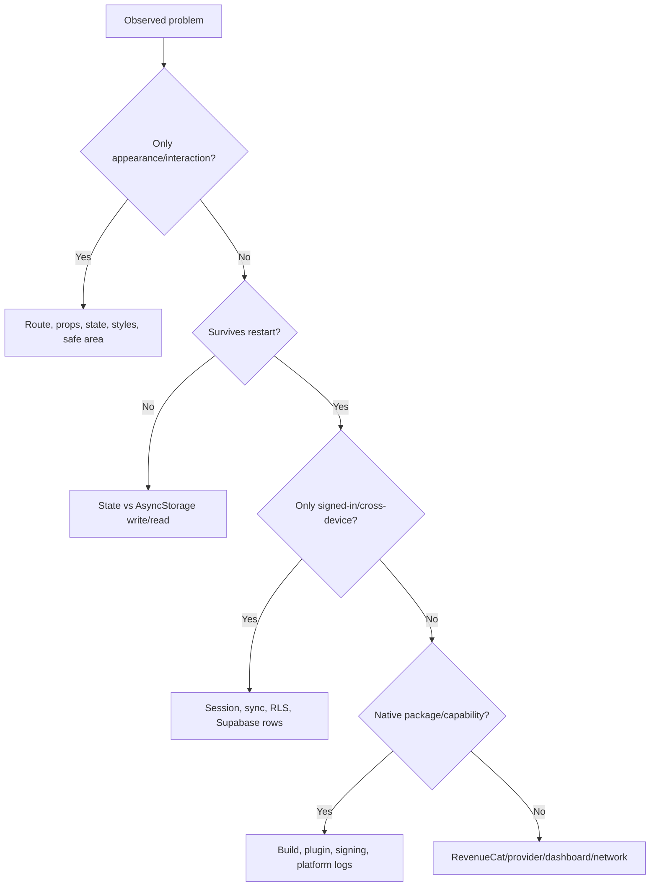

# 9. Testing, debugging, and release

## Development setup

From the app directory:

```bash
npm install
npm start
```

`npm install` reads `package.json`, installs JavaScript packages, and runs
`patch-package` after installation. `npm start` starts Metro and Expo's
development server.

The service-dependent parts read `.env.local`. A development file commonly
contains:

```text
EXPO_PUBLIC_SUPABASE_URL=...
EXPO_PUBLIC_SUPABASE_PUBLISHABLE_KEY=...
EXPO_PUBLIC_REVENUECAT_TEST_API_KEY=...
```

Environment changes usually require restarting Expo, ideally clearing Metro's
cache when behaviour looks stale.

Never commit private server credentials. Remember that every `EXPO_PUBLIC_`
value is visible in the built app.

## What a build is

The source repository contains TypeScript/JavaScript plus configuration. A
native **build** compiles and packages:

- the iOS Xcode or Android Gradle native project;
- React Native and Expo native modules;
- assets and app metadata;
- signing identity and entitlements/capabilities;
- a JavaScript bundle for release, or a development-client connection to Metro.

The result is an installable app (`.app`/`.ipa` on iOS or `.apk`/`.aab` on
Android).

### Ways to run ACE TMUA

| Method | What is running | Best for | Limitation |
| --- | --- | --- | --- |
| Expo Go | Generic prebuilt Expo client loads project JS | Fast UI/content work | Only native modules bundled by Expo Go |
| iOS Simulator development build | This app compiled for a simulated iPhone | Native integration/UI without physical device signing | Not real hardware/store environment |
| Physical iPhone development build | This app signed and installed on a device | Camera, notifications, device behaviour | Needs valid signing/capabilities; some need paid team |
| Release/TestFlight build | Store-like signed app | Final purchase/release testing | Slower and production-like configuration required |
| Web | React Native Web in a browser | Quick broad UI inspection | Not proof of native iOS/Android behaviour |

Expo Go and the Simulator are not opposites: Expo Go itself can run in a
simulator. The important distinction is **generic Expo Go client** versus **this
project's custom native build**.

## Standard checks

Run these before merging changes:

```bash
npx tsc --noEmit
npm run lint
npm run validate:practice
```

When network/service configuration is in scope, also run:

```bash
npm run check:services
```

### TypeScript

`npx tsc --noEmit` checks types without creating output files. It catches
invalid props, missing fields, impossible route values, and many incorrect API
uses. It does not prove runtime behaviour or content correctness.

### ESLint

`npm run lint` runs Expo's lint configuration. It catches unused imports,
unsafe hook patterns, unescaped JSX text, and style/quality issues. A clean lint
run does not prove that the app displays correctly.

### Practice validation

`npm run validate:practice` checks IDs, option counts, answers, test/blueprint
counts, candidate availability, duplicates, and balanced maths markers. It does
not prove that a maths answer or explanation is factually correct.

### Service audit

`npm run check:services` makes real network requests to the configured
Supabase and RevenueCat projects. It checks availability, provider settings,
tables, one anonymous RLS rejection, SDK key acceptance, and offering packages.

It does not complete a purchase, verify every RLS policy, invoke deletion as a
real user, or prove an iOS paywall renders. Treat it as a smoke test.

## Manual test journeys

A release candidate should be tested as complete journeys, not isolated pages.

### New guest

1. Clear app data/install fresh.
2. Complete every onboarding step as guest.
3. Verify target, schedule, and reminder denial/acceptance behaviour.
4. Complete a lesson and restart the app.
5. Confirm Home and Learn retain completion.

### Email account

1. Create an account with confirmation enabled.
2. Verify the app clearly says confirmation is required.
3. Open the email deep link and confirm automatic sign-in.
4. Complete progress, sign out, sign back in, and verify it returns.
5. Test password reset from request through new password.

### Google and Apple

1. Cancel the provider sheet and confirm the app recovers.
2. Sign in successfully and inspect correct profile/identity.
3. Sign out and sign in on another installation/device.
4. Confirm progress is not mixed between two accounts.

### Lesson

1. Test every screen type.
2. Answer correctly and incorrectly.
3. Rapidly tap Finish to look for duplicate completion.
4. Inspect simple, long, fractional, rooted, integral, and bracketed maths.
5. Check narrow and large devices, Dynamic Type/accessibility if supported.

### Practice

1. Start timed and untimed attempts.
2. Answer, flag, navigate, exit, and resume.
3. Confirm a timed attempt continues while away.
4. Let time expire and also submit manually.
5. Verify score, topic totals, answer mapping, and explanation maths.
6. Generate several Premium mocks and inspect distribution/uniqueness.

### Premium

1. Test cancel, purchase, restore, already-Premium, and expired access.
2. Verify every product grants exactly the configured entitlement.
3. Confirm the Supabase webhook mirror changes after test events.
4. Open subscription management.
5. Test on a native development/release environment, not only Expo Go.

### Account deletion

1. Test email, Google, and Apple users separately.
2. Confirm incomplete text cannot delete.
3. Confirm cancelling Apple reauthentication leaves the account intact.
4. Verify RevenueCat customer and all Supabase rows are removed.
5. Verify local storage/reminders are cleared and onboarding returns.
6. Confirm the store subscription remains manageable/cancellable separately.

## Debugging by layer

When something fails, first classify it.



Useful evidence includes:

- the first red error, not hundreds of downstream warnings;
- route parameters and current session ID (never print tokens);
- whether the value exists in AsyncStorage and/or Supabase;
- RevenueCat debug logs and current entitlement names;
- Xcode/Android native build logs;
- the exact environment: Expo Go, simulator dev build, physical device, or
  release build.

## Common symptoms

| Symptom | First places to inspect |
| --- | --- |
| App always opens onboarding | Stored `onboardingCompleted`, account load, route guard |
| Account created but not signed in | Supabase email confirmation setting and callback link |
| Progress missing after different login | Last-synced-user clearing rule and remote data |
| Lesson remains locked | `completedLessonIds`, JSON order, previous lesson ID |
| Maths is tiny/clipped/wraps badly | `MathText`, supplied font style, marker boundaries, flex layout |
| Mock changes on resume | Whether `questionIds` were saved and resolved |
| Timer pauses or jumps | `startedAt`, device clock, mode, elapsed calculation |
| Wrong answer is marked correct | Zero-based `answerIndex`, stable question ID, selected index |
| Premium paywall unavailable | Native build, API key, current offering/paywall/packages |
| Purchase does not unlock | Product-to-entitlement connection and entitlement ID spelling |
| Cloud write denied | Current session, row owner UUID, RLS policy |
| Delete fails | Function deployment/secrets, session JWT, RevenueCat deletion response |
| Physical iPhone build cannot sign | Apple team, certificate, provisioning profile, unsupported capabilities |

## Native configuration changes need rebuilding

Changing ordinary TypeScript or lesson JSON usually refreshes through Metro.
Changing native configuration—plugins, bundle ID, entitlements, native package
versions, icons/splash resources—usually needs a new native build.

`app.json` currently refers to `assets/curvedacetmua.png` for the splash image,
while the repository contains `assets/curveracetmua.png`. Resolve that filename
mismatch before relying on a clean release build.

## Current quality gaps

The project has static checks and service smoke tests but no committed unit,
component, or end-to-end test suite. High-value next tests would cover:

- practice blueprint selection and distribution;
- score/topic-result calculation;
- profile conflict resolution;
- streak/day-boundary calculations;
- maths marker transformation;
- account reducer/provider behaviours with mocked services;
- a small Maestro/Detox-style journey for onboarding, lesson, and practice.

Other current release gaps include:

- replace or hide the static leaderboard before claiming it is live;
- complete privacy policy, terms, support URL, and in-app links;
- production Apple/Google auth configuration and provider testing;
- production RevenueCat platform keys, products, offerings, paywall, webhooks,
  tax/banking agreements, and restore tests;
- deploy Edge Functions with all secrets and test deletion end to end;
- verify notification wording and permissions on physical devices;
- accessibility, small-screen, offline, slow-network, and crash testing;
- final bundle/package identifiers, store metadata, screenshots, age/privacy
  disclosures, and review notes.

## A safe change workflow

1. Pull current changes and inspect `git status`.
2. Create a focused branch.
3. Understand the user journey and data ownership before editing.
4. Make the smallest coherent change.
5. Run TypeScript, lint, and relevant content/service checks.
6. Manually run the affected journey in the right environment.
7. Review the diff for unrelated/generated/secrets changes.
8. Commit with a message explaining the behaviour changed.
9. Ask another team member to review logic and visible behaviour.

The quality of a software engineer is not measured by remembering syntax. It is
measured by forming a model, gathering evidence, making controlled changes, and
verifying the result.
