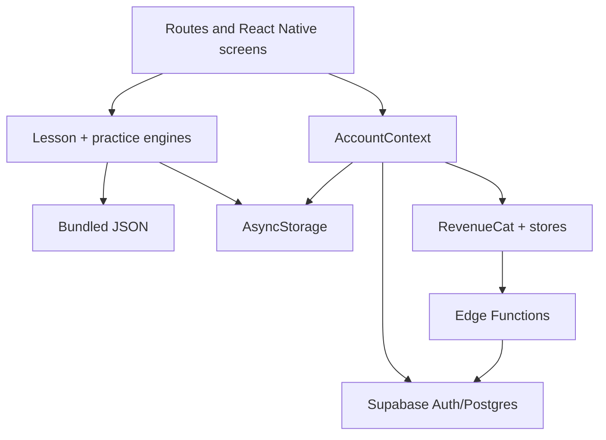

# 10. Interview guide

## A 30-second explanation

“ACE TMUA is a local-first mobile learning app built with Expo and React Native.
Expo Router maps files to screens, while JSON drives 32 lessons and a practice
question bank. Lessons use a typed screen state machine and MathJax-to-SVG for
LaTeX. Practice mocks support fixed sets or balanced random blueprints, with
resumable timed sessions. AsyncStorage saves progress immediately, Supabase adds
authentication and cross-device sync with Row Level Security, and RevenueCat
maps App Store/Play purchases to a Premium entitlement. Privileged webhook and
account-deletion work runs in Supabase Edge Functions.”

Practise saying that naturally rather than memorising it word for word.

## A two-minute system explanation

Start with the user experience, then move down the stack:

“The app has Home, Learn, Practice, Leaderboard, and Profile tabs. Expo Router
uses files in `src/app` as routes, and the root layout wraps them in a global
Account provider. That provider reconstructs a local profile, checks a persisted
Supabase session, synchronises progress if signed in, and configures RevenueCat.
It also guards onboarding before the main app appears.

“The learning content is separated from rendering. `lessons.json` contains
typed screen objects such as concept, reveal, multiple choice, and worked
example. `LessonPlayer` tracks the screen, reveal position, and score, switches
to a reusable component for each type, then persists completion. Prose is native
React Native text for wrapping, while `[[LaTeX]]` expressions are turned into
MathJax SVG. Fixed diagrams use `react-native-svg`.

“Practice definitions are either static or blueprint-based. A blueprint selects
a controlled number of questions for each paper/topic/difficulty slot. The
selected IDs are stored in the session, so a random mock remains stable when it
is resumed or reviewed. Answers, flags, position, and timestamps are local-first.
The timer is calculated from `startedAt`, so it keeps running while a timed
attempt is left. Submission marks by question ID and creates total and topic
results.

“AsyncStorage gives immediate/offline persistence. On authentication, sync
uploads local append-like records, applies simple profile conflict rules, then
downloads and merges cloud progress. Supabase RLS limits rows to the authenticated
UUID. RevenueCat uses that same UUID and is the immediate Premium source of
truth. Its webhook mirrors entitlements to Supabase, while a separate verified
Edge Function handles full account deletion and external cleanup.”

## Be ready to draw this

If you can redraw it and explain each arrow, you understand the architecture.

## Likely interview questions and strong answers

### Why Expo instead of plain React Native?

Expo provides a versioned set of compatible native modules, configuration
plugins, Metro tooling, development builds, and Expo Router. That reduced native
setup while still allowing native capabilities such as notifications, Apple
authentication, and RevenueCat through a custom development build. The trade-off
is following Expo's SDK compatibility and rebuilding when native configuration
changes.

### How is this different from a website?

Components render native views, not DOM elements. Styling uses React Native
layout objects rather than CSS. Native modules must be compiled into the app.
Expo Router feels web-like because files map to routes, but navigation is native
screen state rather than ordinary browser page loads.

### Why is the app local-first?

Students should not lose a lesson or timed attempt because the network is poor.
The app awaits the on-device write and treats cloud sync as best effort. Stable
client IDs and upserts make retries safe. The trade-off is conflict-resolution
complexity and the need to be explicit about what happens when accounts switch.

### What happens when a lesson is completed?

The player prevents duplicate completion with a ref, stores the lesson ID,
creates an activity containing duration and answer totals, saves it locally,
and starts an idempotent Supabase upsert. Home later derives progress/streak
from those records, and the Learn roadmap unlocks the next lesson.

### How do lessons avoid one component per page?

Content uses a discriminated union of seven screen types. JSON chooses the type
and supplies its fields. The player switches on `screen.type`, and TypeScript
narrows the object to the correct interface. This separates content scale from
UI implementation.

### How is maths rendered?

Authors wrap LaTeX in `[[...]]`. `PlainOrHtml` splits a string into prose and
math tokens. Prose stays native for wrapping; each nontrivial expression is
rendered by MathJax as SVG. Legacy superscript/fraction HTML remains as a
fallback. Fixed teaching diagrams are direct React Native SVG components.

### Why not render the entire paragraph with MathJax?

It would make all text one SVG/HTML rendering context, hurting native wrapping,
font consistency, and potentially accessibility. The hybrid approach gives
complex structures to MathJax while keeping prose native, though it requires
care around line breaks between flex items.

### How are random mocks kept balanced?

The test contains blueprint slots by paper style, topic, difficulty, and count.
Selection shuffles candidates within each slot, takes exactly the count, then
shuffles the combined IDs. Validation checks candidate supply and distribution.
Those IDs are stored in the session, so resume and review never rerandomise.

### Why does the timer still run outside the screen?

It derives elapsed time from `Date.now() - startedAt`; the one-second interval
only refreshes display state. Storing a decrementing counter would pause when
JavaScript is suspended and drift due to delayed intervals.

### How do you prevent duplicate practice submissions?

A ref (`submittingRef`) is checked and set synchronously before asynchronous
save work. The latest session is read from another ref to avoid a stale closure.
The result is saved before the session is cleared and navigation is replaced.

### How does cross-device sync resolve conflicts?

It detects an account switch first, uploads local progress only when it belongs
to the same/first user, and then merges remote data. Completed IDs union;
activities/results merge by stable IDs; the newest session per test wins. The
profile uses remote onboarding completion and `updatedAt` as simple whole-profile
rules. I would move to per-field versions or a mutation queue if collaborative
or high-frequency edits grew.

### Why is the Supabase public key safe in the app?

It identifies the project but does not bypass authorization. Every user table
has RLS comparing the JWT's `auth.uid()` with the row owner. Private service-role
and provider secrets exist only in server-side function settings.

### What is the difference between authentication and authorisation?

Authentication proves identity and establishes the Supabase UUID. Authorisation
decides what that UUID can do: Postgres RLS scopes its rows, and RevenueCat's
entitlement determines Premium UI access.

### How does Google sign-in work?

The app asks Supabase for a Google OAuth URL, opens it in a secure system browser,
Google returns to Supabase, and Supabase redirects to the app's custom
`acetmua://auth/callback`. The app exchanges the returned code for a session.
The client secret remains in provider/Supabase configuration, not mobile code.

### How does Apple sign-in protect against replay?

The app creates a random nonce, gives Apple its hash, and sends Supabase the
identity token plus original nonce. Supabase verifies that they match. Apple's
native capability and provider setup also need the correct paid developer
configuration.

### Why RevenueCat as well as a Supabase entitlement table?

RevenueCat validates and normalises store purchase state and is the immediate
client source of truth. The webhook-maintained Supabase row gives the backend a
queryable mirror for future server-side features. The app does not trust a
client-writable Premium boolean.

### What happens during account deletion?

Profile asks for explicit confirmation and offers subscription management. The
app sends the authenticated JWT to an Edge Function; it derives the current
user from the token, deletes RevenueCat customer data, attempts Apple token
revocation when applicable, and admin-deletes the Auth user. Foreign-key
cascades delete database rows. Only after server confirmation does the app
clear local storage and reminders.

### How do notifications work?

They are local scheduled notifications, not remote push. Weekly reminders are
created for selected days/time and their IDs are stored for rescheduling. A
trial reminder checks RevenueCat's actual trial expiration. Notification taps
are allow-listed to Home or Profile in the root layout.

### What testing exists?

TypeScript and ESLint cover static correctness. A practice-bank script validates
content and blueprint invariants. A service audit checks Supabase health/tables,
one RLS denial, and RevenueCat offerings. Manual end-to-end journeys cover
native/auth/purchase behaviour. A major next improvement is automated unit tests
for selection, scoring, sync, streaks, and maths transformations plus a small
mobile E2E suite.

### What would you refactor first?

Split `AccountContext` into narrower account/sync/purchase concerns while keeping
a simple consumer API; add a persistent sync queue and clearer conflict metadata;
centralise duplicated topic metadata; add schema-generated database types; and
introduce automated tests around pure functions before changing behaviour.

### What is the biggest current product/technical risk?

External release configuration is the largest immediate risk: production store
products/keys, auth providers, signed capabilities, webhook secrets, deletion,
and legal/store metadata need real end-to-end verification. In code, content
correctness and maths layout across device sizes need systematic regression
testing.

## Design decisions and trade-offs

Interviewers often care more about trade-offs than the technology list.

| Decision | Benefit | Cost/limitation |
| --- | --- | --- |
| JSON-driven lessons | Content scales without new screens | Runtime/content validation needed |
| Hybrid native + MathJax maths | Good prose wrapping and complex notation | Inline SVG layout can be quirky |
| Local-first storage | Fast, offline, resilient | Conflict and retry logic |
| Supabase | Fast Auth/Postgres/RLS/Functions | Vendor dependency and dashboard setup |
| RevenueCat | One entitlement layer over stores | Native/build/dashboard complexity |
| Blueprint mocks | Fresh but balanced papers | Bank needs enough questions per slot |
| One large AccountContext | Easy consistent consumer API | Growing coupling and rerenders |
| Bundled Premium content | Offline/simple | UI gate, not secret content protection |
| Local notifications | No push backend | Cannot centrally change/send campaigns |

## How to discuss AI-assisted development honestly

Do not claim that every line was written manually. Also do not diminish the
project to “AI made it.” A strong, honest answer is:

“I used AI extensively as an implementation accelerator, especially for
porting repetitive UI and drafting content. My responsibility was defining the
product behaviour, integrating the parts, reviewing changes, diagnosing real
device and service issues, and validating the result. I realised generated code
had left me with gaps in my mental model, so I traced the repository end to end
and documented the runtime, persistence, auth, purchase, and security flows. I
can now explain the architecture, its trade-offs, the current risks, and how I
would test or refactor it.”

Then prove that statement by answering follow-up questions with concrete file
names and flows.

Avoid saying:

- “I don't know; AI wrote it.”
- “Supabase stores everything” when local storage and RevenueCat matter.
- “It is secure because the key is hidden” when publishable keys are public.
- “It has unit tests” when it currently has static/content/service checks.
- “The leaderboard is live” when its data is static.
- “Premium content cannot be accessed” when it is bundled and client-gated.

## A code-tour route for an interviewer

If asked to share the repository, guide them through a deliberate path:

1. [`src/app/_layout.tsx`](../src/app/_layout.tsx) — startup, provider, route
   guard, tabs.
2. [`src/contexts/AccountContext.tsx`](../src/contexts/AccountContext.tsx) —
   account, sync entry, RevenueCat orchestration.
3. [`src/components/lesson/LessonPlayer.tsx`](../src/components/lesson/LessonPlayer.tsx)
   and [`types.ts`](../src/components/lesson/types.ts) — data-driven state machine.
4. [`src/components/lesson/MathText.tsx`](../src/components/lesson/MathText.tsx)
   — hybrid maths pipeline.
5. [`practice-data.ts`](../src/components/practice/practice-data.ts) and
   [`PracticeTestRunner.tsx`](../src/components/practice/PracticeTestRunner.tsx)
   — selection, persistence, timer, submission.
6. [`account-sync.ts`](../src/services/account-sync.ts) — local/cloud merge.
7. [`supabase/schema.sql`](../supabase/schema.sql) — tables, triggers, RLS.
8. [`supabase/functions`](../supabase/functions) — trusted boundaries.

This demonstrates architecture rather than scrolling randomly through styling.

## Exercises that turn documentation into understanding

Complete these without copying an answer:

1. Trace one lesson completion from button to Home streak.
2. Explain why `screenIndex` is state but completed IDs are storage.
3. Add a temporary console message at each stage of sign-in sync, then remove it.
4. Write a tiny new practice question and predict every validation rule.
5. On paper, calculate the timer after leaving a timed attempt for 90 seconds.
6. Explain how a malicious client is stopped from reading another profile.
7. Describe the state after purchase if the webhook is delayed by a minute.
8. Describe the state after a local result saves while Supabase is offline.
9. Find three places that gate a Premium mock and explain why they repeat.
10. Propose a test for a function before reading its implementation.

When you can perform those exercises and answer the questions above in your own
words, you can confidently use the project on your CV.
